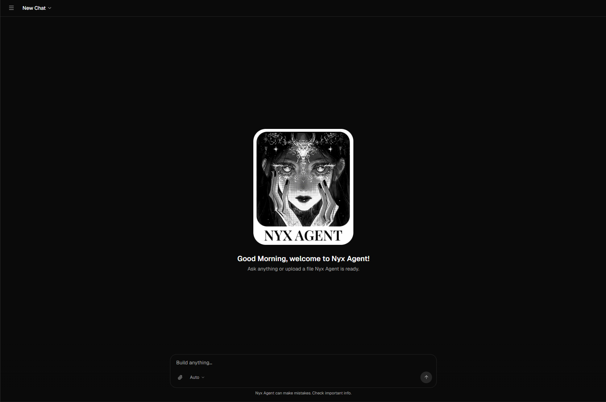

<div align="center">
  
  <h1>NYX AGENT</h1>
  <p>An open-source AI chat assistant powered by multi-provider LLMs NVIDIA NIM, Groq, Google Gemini, Ollama, and any OpenAI-compatible endpoint.</p>

  <p>
    <a href="https://github.com/rzkyerl/nyx-agent/stargazers"></a>
    <a href="https://github.com/rzkyerl/nyx-agent/forks"></a>
    <a href="https://github.com/rzkyerl/nyx-agent/blob/main/LICENSE"></a>
    <a href="https://github.com/rzkyerl/nyx-agent/issues"></a>
    
    
  </p>
</div>

---



---

## Overview

Nyx Agent is a production-ready, open-source AI chat assistant built with **Next.js 16**, **React 19**, and the **Vercel AI SDK**. It supports multiple LLM providers with automatic fallback, streaming responses, web search, file uploads, and document generation all in a clean, minimal UI.

Built by [CTRL Build](https://github.com/rzkyerl).

## Features

- **Multi-provider with automatic fallback** `auto` mode tries NIM → Groq → Gemini in sequence until a successful response
- **Custom providers** add any OpenAI-compatible endpoint (e.g. LM Studio, vLLM, OpenRouter) with your own base URL and API key; validated and stored locally
- **Streaming chat** with full Markdown rendering (GFM tables, code blocks with syntax highlighting via react-shiki)
- **Web search** automatically detects queries needing real-time information and fetches results via LangSearch or Serper; citations shown inline as numbered sources
- **File uploads** read and analyze PDFs, Word documents, Excel spreadsheets, PowerPoint files, images, and plain text directly in chat
- **Document generation** generate and download PDF, Word (.docx), or Excel (.xlsx) files from any assistant response
- **Persistent chat history** sessions stored in `localStorage` with pin, rename, and delete support
- **Auto-generated titles** session titles are generated by the AI after the first exchange
- **Model health checks** the UI pings each provider before you send a message so unavailable models are clearly marked
- **Observability** optional request tracing and logging via Langfuse
- **Self-hosted models** supports Ollama with a custom endpoint (e.g. Google Colab + Tailscale)
- **Dark / light mode**

## Tech Stack

| Layer | Technology |
|---|---|
| Framework | [Next.js 16](https://nextjs.org) (App Router, Turbopack) |
| UI | [React 19](https://react.dev), [shadcn/ui](https://ui.shadcn.com), [Base UI](https://base-ui.com), [Tailwind CSS 4](https://tailwindcss.com) |
| AI | [Vercel AI SDK 7](https://ai-sdk.dev) |
| Observability | [Langfuse](https://langfuse.com) |
| File handling | pdfjs-dist, mammoth, ExcelJS, @react-pdf/renderer, docx |

---

## Supported Models

| Provider | Models | Required env var |
|---|---|---|
| **NVIDIA NIM** | GPT OSS 20B, DeepSeek V4 Pro, DeepSeek V4 Flash, Kimi K3, Nemotron 3 Ultra | `NVIDIA_NIM_API_KEY` |
| **Groq** | Compound, GPT OSS 120B, Qwen 3.6-27B, Compound Mini | `GROQ_API_KEY` |
| **Google Gemini** | Gemini 3.1 Pro, Gemini 3.6 Flash, Gemini 3.5 Flash Lite | `GOOGLE_GEMINI_API_KEY` |
| **Ollama** | Llama 3.1 8B, Qwen 2.5 7B *(experimental)* | `OLLAMA_BASE_URL` |
| **Custom** | Any OpenAI-compatible model | Base URL + API key stored in-browser |

You only need to configure the providers you want to use. At least one API key (or Ollama URL) is required.

---

## Getting Started

### Prerequisites

- [Node.js 20+](https://nodejs.org)
- [pnpm](https://pnpm.io) (`npm install -g pnpm`)

### Installation

```bash
# 1. Clone the repository
git clone https://github.com/rzkyerl/nyx-agent.git
cd nyx-agent

# 2. Install dependencies
pnpm install

# 3. Set up environment variables
cp .env.example .env.local
```

Edit `.env.local` and add at least one provider API key:

```env
# At least one of these is required:
NVIDIA_NIM_API_KEY=your_nim_key_here
GROQ_API_KEY=your_groq_key_here
GOOGLE_GEMINI_API_KEY=your_gemini_key_here

# Optional web search (one or both):
LANGSEARCH_API_KEY=
SERPER_API_KEY=

# Optional self-hosted Ollama:
OLLAMA_BASE_URL=http://your-ollama-host:11434

# Optional Langfuse observability:
LANGFUSE_SECRET_KEY=
LANGFUSE_PUBLIC_KEY=
LANGFUSE_BASE_URL=
```

```bash
# 4. Start the development server
pnpm dev
```

Open [http://localhost:3000](http://localhost:3000).

---

## Environment Variables

| Variable | Required | Description |
|---|---|---|
| `NVIDIA_NIM_API_KEY` | One of these* | NVIDIA NIM API key |
| `GROQ_API_KEY` | One of these* | Groq API key |
| `GOOGLE_GEMINI_API_KEY` | One of these* | Google Gemini API key |
| `LANGSEARCH_API_KEY` | Optional | Web search via LangSearch |
| `SERPER_API_KEY` | Optional | Web search via Serper (fallback) |
| `OLLAMA_BASE_URL` | Optional | Ollama self-hosted endpoint URL |
| `LANGFUSE_SECRET_KEY` | Optional | Langfuse observability secret key |
| `LANGFUSE_PUBLIC_KEY` | Optional | Langfuse observability public key |
| `LANGFUSE_BASE_URL` | Optional | Langfuse instance URL (defaults to cloud) |

\* At least one provider key must be configured. Custom providers are configured through the UI and stored in the browser no env var needed.

---

## How It Works

### API Routes

| Route | Description |
|---|---|
| `POST /api/chat` | Main streaming endpoint. Handles web search, model selection, provider fallback, and SSE streaming. |
| `GET /api/search` | Executes a web search via LangSearch or Serper. |
| `POST /api/title` | Generates a session title from the first exchange. |
| `POST /api/export` | Generates a downloadable PDF, DOCX, or XLSX from given content. |
| `POST /api/models/health` | Pings a list of model IDs and returns `ready`, `unavailable`, or `not-configured` per model. |
| `POST /api/providers/validate` | Validates a custom OpenAI-compatible provider by calling its `/v1/models` endpoint and returning the available model list. |

### Auto Fallback Order

When `auto` model is selected, the system attempts providers in this order, skipping any without a configured API key:

```
NIM: GPT OSS 20B → Kimi K3 → Nemotron Ultra → DeepSeek V4 Flash → DeepSeek V4 Pro
Groq: Compound → GPT OSS 120B → Qwen 3.6-27B → Compound Mini
Gemini: Gemini 3.6 Flash → Gemini 3.5 Flash Lite → Gemini 3.1 Pro
```

### Custom Providers

Any OpenAI-compatible endpoint can be added from the Settings panel:

1. Open Settings → Custom Providers
2. Enter a display name, base URL (e.g. `http://localhost:1234/v1`), and API key
3. Kiro validates the endpoint via `/api/providers/validate` and fetches the model list
4. The provider and its models are stored in `localStorage` and available immediately

Custom providers can optionally be configured as **direct connection** requests go straight from the browser to the provider, bypassing the `/api/chat` proxy (useful for localhost endpoints).

### Document Generation

When the AI response includes an `export-config` block, a download button appears automatically. The block specifies the file type (`pdf`, `docx`, `xlsx`), template style (`academic`, `formal`, `informal`), and font. The `/api/export` route renders the content and streams back the binary file.

Supported fonts: Inter, Lora, Playfair Display, Merriweather, Roboto, Open Sans, Montserrat, Source Sans 3.

### Key Files

| File | Description |
|---|---|
| `app/api/chat/route.ts` | Core streaming handler with provider routing and fallback |
| `app/api/models/health/route.ts` | Model health-check endpoint |
| `app/api/providers/validate/route.ts` | Custom provider validation endpoint |
| `lib/models.ts` | Model definitions and provider configuration |
| `lib/system-prompt.ts` | System prompt builder per model/provider |
| `lib/storage.ts` | Session and settings persistence (localStorage) |
| `components/chat/nyx-chat.tsx` | Root client component |
| `components/chat/composer.tsx` | Message input, file upload, model selector |
| `components/chat/chat-area.tsx` | Message list, suggestion chips |
| `components/chat/sidebar.tsx` | Session list with pin/rename/delete |
| `components/chat/settings-panel.tsx` | Theme, preferences, and custom provider management |
| `hooks/use-chat-session.ts` | Session state management |
| `hooks/use-stream-chat.ts` | SSE streaming and event parsing |
| `hooks/use-export-file.ts` | Document generation and download |

---

## Scripts

```bash
pnpm dev        # Start development server (Turbopack)
pnpm build      # Production build
pnpm start      # Start production server
pnpm lint       # Run ESLint
pnpm format     # Run Prettier
pnpm typecheck  # Run TypeScript type check
```

---

## Contributing

Contributions are welcome! Here's how to get started:

1. **Fork** the repository and create your branch from `main`:
   ```bash
   git checkout -b feature/your-feature-name
   ```
2. **Make your changes** and ensure code quality:
   ```bash
   pnpm lint && pnpm typecheck
   ```
3. **Commit** your changes with a clear message:
   ```bash
   git commit -m "feat: add support for XYZ"
   ```
4. **Push** to your fork and open a **Pull Request**.

### What We're Looking For

- New LLM provider integrations
- UI/UX improvements
- Performance optimizations
- Bug fixes
- Documentation improvements
- Accessibility improvements

### Reporting Issues

Found a bug or have a feature request? [Open an issue](https://github.com/rzkyerl/nyx-agent/issues) please include steps to reproduce, expected behavior, and your environment details.

---

## Security

The `/api/chat` route is **public and unauthenticated** every request consumes your API key credits. Before deploying to production:

- **Rate limit requests.** Use Vercel Firewall rules or [`@upstash/ratelimit`](https://github.com/upstash/ratelimit-js) to prevent credential drain.
- **Add authentication** if this isn't intended to be a public chatbot.
- **Set spend limits** in each provider's dashboard as a backstop.

The route already validates the request body, restricts models to the defined list in `lib/models.ts`, caps output tokens per request, and aborts on client disconnect but those only bound individual requests, not total volume.

---

## License

MIT see [LICENSE](LICENSE) for details.

---

<div align="center">
  <p>Made with ♥ by <a href="https://github.com/rzkyerl">CTRL Build</a></p>
  <p>If this project helps you, consider giving it a ⭐</p>
</div>
